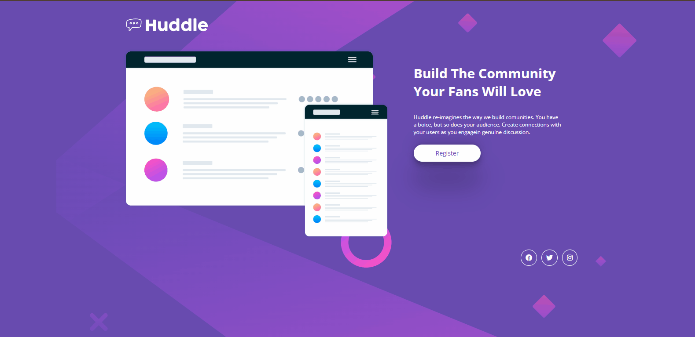
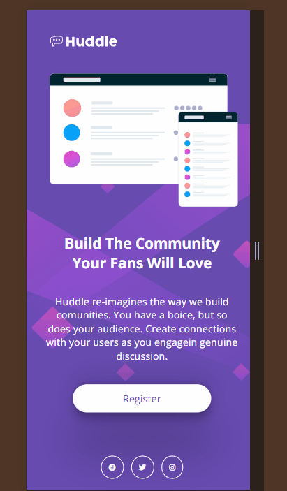

    

<h1 align="center">
    Thiago da Silva Alves - Projeto Quest Huddle 🚀
</h1>

    Um projeto proposto pelo curso <a href="https://www.instagram.com/devemdobro?igsh=MXZrajR4NHg4a24yZg==" target="_blank">DevQuest</a>. <a href="https://github.com/thiagoSilvaAlves/quest-huddle" target="_blank">Projeto - Quest Huddle</a>, realizado com HTML e CSS, focando no aprendizado passado nos módulos básico, intermidário e avançado. Atualmente hospedado no <a href="https://thiagosilvaalves.github.io/quest-huddle" target="_blank">GitHub Pages</a>.

## Design:

- Desktop:
  

    
  

- Mobile:
  

    
  

### Link do Projeto: <a href="https://github.com/thiagoSilvaAlves/quest-huddle" target="_blank">https://github.com/thiagoSilvaAlves/quest-huddle</a>

## Tecnologias utilizadas:

- HTML
- CSS

### Veja as minhas redes sociais abaixo para falar comigo!

 

    
    
    
 

